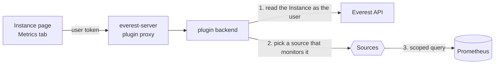

# plugin-metrics

OpenEverest plugin that charts database instance metrics right on the instance
page, so users don't have to switch to Grafana for a quick look.

It adds a **Metrics** tab with a small dashboard (CPU, memory and
engine-specific panels) and a *Last hour / Last 24 hours* switch. A search box
adds any other metric the instance exposes as an extra chart for the session —
nothing is saved; for deeper digging use Grafana, PMM or similar.

## How it works



1. Every request is authorized by reading the Instance from the Everest API
   **with the caller's token**, so users only see metrics of instances they can read.
2. The backend asks each configured **source** whether it monitors the instance
   and uses the first one that does.
3. It runs the dashboard's queries for that source. Queries come from the
   plugin's configuration, never from the browser, and are always scoped to the
   instance, because Prometheus itself has no per-tenant isolation.

### Sources

A source is one monitoring system ([backend/internal/source/source.go](backend/internal/source/source.go)):

```go
type Source interface {
    Type() string // keys this source's queries in dashboards, e.g. "prometheus"
    Status(ctx, target) (Status, error)
    QueryRange(ctx, target, query, window) ([]Series, error)
}
```

| Source | Monitored when | Scoping |
|---|---|---|
| `prometheus` | The provider created a PodMonitor for the instance (labels `app.kubernetes.io/managed-by=everest`, `app.kubernetes.io/instance=<name>`) | `${selector}` expands to the instance's namespace and scrape jobs |

Adding a system (e.g. PMM) means adding a `Source` and a `pmm:` query to the
panels that support it. The frontend renders whatever series it gets back and
doesn't change.

### Dashboards

Panels are data, keyed by provider, in
[backend/internal/dashboard/dashboards.yaml](backend/internal/dashboard/dashboards.yaml):

```yaml
dashboards:
  milvus:
    panels:
      - id: cpu
        title: CPU usage by component
        unit: cores            # cores, bytes, Bps, ops (per second), ms, or empty
        queries:
          prometheus: >-
            sum by (core_openeverest_io_component) (rate(process_cpu_seconds_total{${selector}}[${rate}]))
```

`${rate}` is a `rate()` window matched to the selected time range. Each series
is named after the labels the query keeps (here, the component).

Built-in dashboards:

| Provider | Panels |
|---|---|
| `milvus` | Requests per second, search/query latency p99, CPU and memory by component |

### Custom dashboards

Admins can add dashboards for more providers or replace the built-in ones
without rebuilding the plugin, through a ConfigMap in the same format. Set them
in the chart values, which renders the ConfigMap:

```yaml
dashboards:
  overrides:
    valkey:
      panels:
        - id: commands
          title: Commands per second
          unit: ops
          queries:
            prometheus: >-
              sum by (valkey_io_shard_index) (rate(redis_commands_processed_total{${selector}}[${rate}]))
        - id: memory
          title: Memory used by shard
          unit: bytes
          queries:
            prometheus: >-
              sum by (valkey_io_shard_index) (redis_memory_used_bytes{${selector}})
plugin:
  extensionPoints:
    - type: clusterDetailTab
      path: metrics
      label: Metrics
      providers: [milvus, valkey]   # show the tab for the new provider
```

or point `dashboards.existingConfigMap` at a ConfigMap you manage yourself
(key `dashboards.yaml`, content `dashboards: {...}`), e.g. with GitOps.

- A provider's dashboard replaces its built-in one as a whole; `{panels: []}`
  hides it (the metric search stays available).
- Edits to the ConfigMap apply within about a minute, without a restart.
- Every Prometheus query must use `${selector}`. A file with an invalid
  dashboard or an unscoped query is rejected as a whole: the plugin keeps the
  last good dashboards and logs why.

## Requirements

- OpenEverest with plugin support (`plugins.extensions.openeverest.io` CRD).
- The [Prometheus Operator](https://prometheus-operator.dev) and a Prometheus
  that selects the providers' PodMonitors (for kube-prometheus-stack, set the
  provider's `podMonitorLabels` to `release: <release-name>`).
- Prometheus monitoring enabled on the instance (for Milvus, the
  *Monitoring → Prometheus* toggle).

## Installation

```bash
helm install plugin-metrics charts/plugin-metrics \
  --namespace everest-system \
  --set prometheus.url=http://kube-prometheus-stack-prometheus.monitoring.svc:9090
```

| Value | Default | Description |
|---|---|---|
| `prometheus.url` | `http://kube-prometheus-stack-prometheus.monitoring.svc:9090` | In-cluster Prometheus HTTP API |
| `dashboards.overrides` | `{}` | Dashboards added or replaced by provider (see [Custom dashboards](#custom-dashboards)) |
| `dashboards.existingConfigMap` | `""` | Your own ConfigMap with `dashboards.yaml`; wins over `overrides` |
| `plugin.extensionPoints[0].providers` | `[milvus]` | Providers that get the Metrics tab |
| `everestAPIURL` | discovered | Everest API the backend authorizes against |

## API

Served under `/v1/clusters/{cluster}/plugins/plugin-metrics` by everest-server.

| Endpoint | Returns |
|---|---|
| `GET /api/dashboard?namespace=&instance=` | The active source and its status, and the panels it can fill |
| `GET /api/panels/{id}?namespace=&instance=&range=1h\|24h` | The panel's series |
| `GET /api/metrics?namespace=&instance=` | The instance's raw metrics with type and description (explorer sources only) |
| `GET /api/explore?namespace=&instance=&metric=&type=&range=` | One raw metric charted by type: counters as a per-second rate, histograms as p99, summaries as the average, gauges as is |

Explored queries are built on the backend from a validated metric name and are
scoped like dashboard queries, so they cannot read other instances' metrics.

## Development

```bash
npm install
make test             # backend + frontend tests
make build-frontend   # dist/main.js
make docker-build IMG=<registry>/plugin-metrics:dev
```

### Local environment (Tilt)

```bash
cp dev/.env.example dev/.env   # set OPENEVEREST_VERSION while v2 is in pre-release
make dev-up                    # k3d cluster + tilt up
```

[dev/Tiltfile](dev/Tiltfile) installs the released OpenEverest core,
kube-prometheus-stack, the Milvus provider and a small standalone instance
with Prometheus monitoring on ([dev/demo-instance.yaml](dev/demo-instance.yaml)),
then rebuilds and redeploys the plugin on every change. Open the UI at
http://localhost:8080 (admin / `UI_ADMIN_PASSWORD`) and Prometheus at
http://localhost:9090. Each dependency can be turned off in `dev/.env` to
reuse one you already run. `make dev-down` stops Tilt; `make dev-destroy`
also deletes the cluster.

### Releasing

Push a `vX.Y.Z` (or `vX.Y.Z-<suffix>`) tag. The release workflow builds the
bundle and a multi-arch image, pushes the image and the Helm chart to GHCR
(`oci://ghcr.io/openeverest/charts/plugin-metrics`) and creates a GitHub
release with notes.

The frontend is an ES module loaded by the Everest UI and shares the host's
React (see [vite.config.ts](vite.config.ts)). The backend embeds it and serves
it at `/main.js`.

## Roadmap

- More sources: PMM; Prometheus endpoints registered through `MonitoringConfig`.
- ServiceMonitor discovery and dashboards for more providers.
